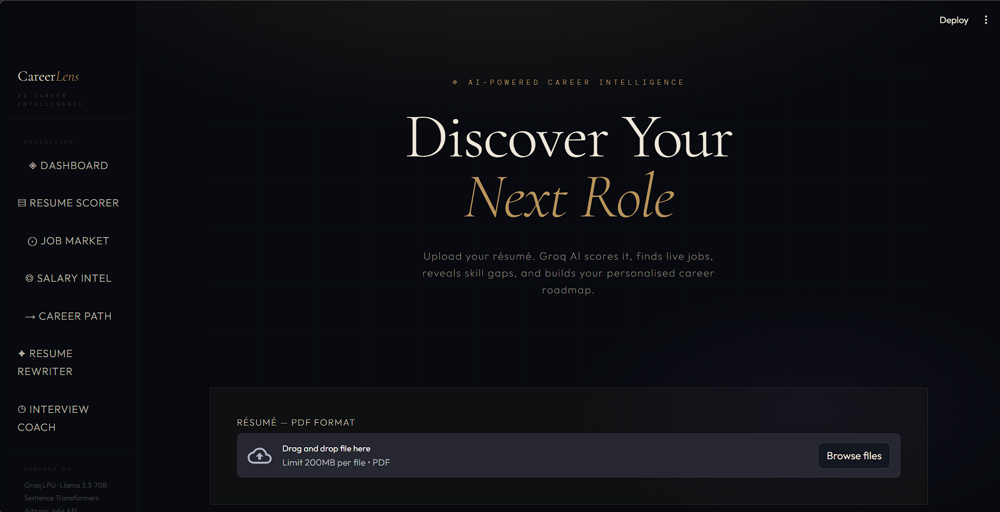

# CareerLens AI

AI-powered career intelligence platform for resume analysis, semantic job matching, skill gap detection, and AI-driven career guidance.



---

# Overview

CareerLens AI is an end-to-end AI-powered career intelligence platform designed to help job seekers better understand their resumes, identify missing skills, discover relevant career paths, and improve job readiness using AI and semantic search techniques.

The system combines:

- Resume parsing
- Skills extraction
- Semantic role prediction
- Live job intelligence
- Skill gap analysis
- AI-powered career assistance

into a single interactive platform.

---

# Key Features

## Resume Analysis

- PDF resume parsing
- Text preprocessing and normalization
- Experience detection with section-aware parsing
- Skills extraction using 6,700+ ESCO-based vocabulary

## Semantic Job Matching

- Embedding-based similarity scoring
- Weighted ranking system
- Skill overlap and density analysis
- Semantic role inference

## AI Career Intelligence

- Resume Scorer
- AI Job Fit Analyzer
- Cover Letter Generator
- Salary Intelligence
- Career Path Planner
- Resume Bullet Rewriter
- Interview Coach

## Live Market Intelligence

- Real-time job fetching using Adzuna API
- Multi-country job support
- Skill demand analysis
- Market heatmap generation

---

# Tech Stack

## Core

- Python 3.11
- Streamlit
- asyncio
- httpx

## AI / NLP

- Sentence Transformers
- Llama 3.3-70B (Groq API)
- scikit-learn
- ESCO Skills Ontology

## APIs

- Adzuna Jobs API
- Groq API

## Data Processing

- pandas
- NumPy
- pdfplumber

---

# Project Structure

```text
project/
├── streamlit_app.py
├── requirements.txt
├── backend/
│   ├── .env
│   ├── data/
│   │   ├── skills_master.json
│   │   ├── role_skill_map_final.json
│   │   └── role_embeddings.pkl
│   ├── resume_processing/
│   │   ├── parser.py
│   │   ├── skills.py
│   │   └── experience.py
│   ├── role_inference/
│   │   └── role_predictor.py
│   ├── job_fetching/
│   │   └── adzuna_client.py
│   ├── analysis/
│   │   └── skill_gap.py
│   ├── market_intelligence/
│   │   ├── intelligence_engine.py
│   │   └── clustering.py
│   ├── matching/
│   │   └── matcher.py
│   └── semantic/
│       └── embedding_engine.py
```

---

# System Workflow

Resume Upload → Skill Extraction → Role Prediction → Live Job Fetching → Semantic Matching → Skill Gap Analysis → AI Insights

---

# Key Engineering Highlights

- Semantic embedding-based matching instead of keyword-only matching
- Async parallel job fetching
- API key rotation and exponential backoff handling
- Embedding caching for performance optimization
- Robust JSON parsing for LLM outputs
- Multi-layer fallback systems for reliability

---

# Fixes & Improvements

## Skills Extraction

- Detects 43+ technical skills accurately
- Supports tri-gram phrase matching
- Generic/noise word filtering
- Vocabulary-based validation

## Experience Detection

- Section-aware work history parsing
- Internship-weight adjustment
- Month-level calculation support

## Job Matching

- Fixed unreliable scoring ranges
- Stable 0–100% scoring system
- Weighted semantic matching architecture

## Role Prediction

- Level-aware role recommendation
- Embedding + heuristic hybrid prediction
- Better fresher/junior role handling

## API Reliability

- Smart query generation
- API key rotation
- Retry logic with exponential backoff
- Async parallel fetching

## Skill Gap Analysis

- Synonym-aware matching
- Noise filtering
- Strong/partial/missing skill categorization

---

# Setup

## Install Dependencies

```bash
pip install -r requirements.txt
```

## Configure Environment Variables

Create a `.env` file inside `backend/`

```env
GROQ_API_KEY=your_key
ADZUNA_APP_ID=your_id
ADZUNA_APP_KEY=your_key
```

---

# Run Application

```bash
streamlit run streamlit_app.py
```

---

# Future Scope

- LinkedIn integration
- User authentication
- Resume version tracking
- Skill trend forecasting
- Employer-side candidate ranking
- Fine-tuned embedding models

---

# Author

Yaswanth Sai
